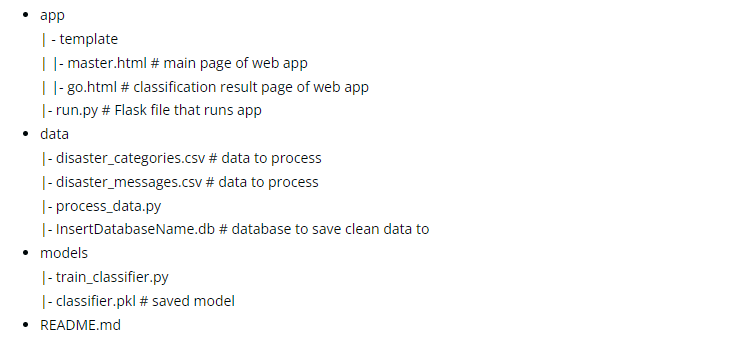
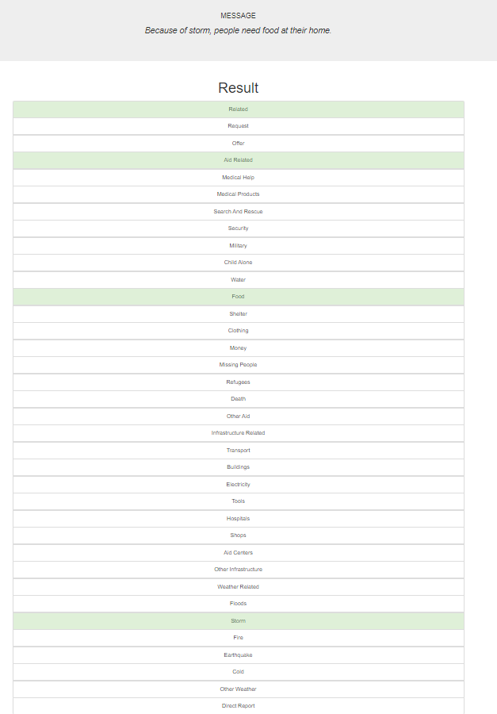
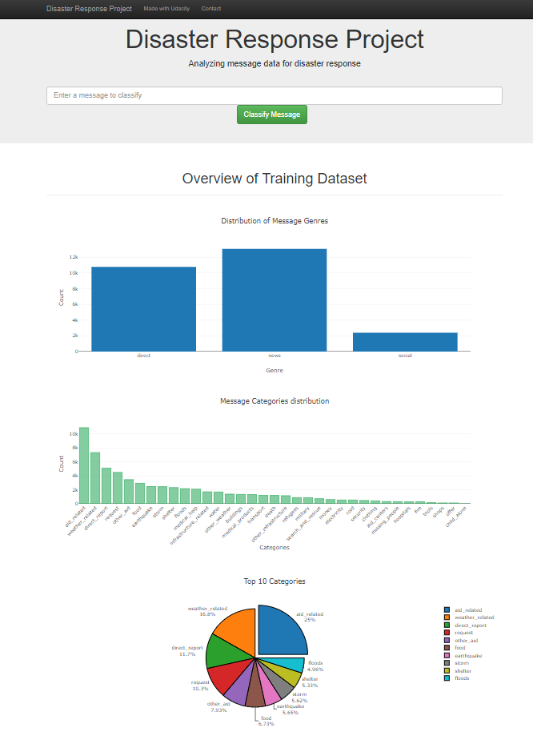

# Data Scientist Nanodegree

## Project: Disaster Response Pipeline

## Table of Contents

- [Project Motivation](#overview)
- [Project Descriptions](#Descriptions)
  - [ETL Pipeline](#etl_pipeline)
  - [Machine Learning Pipeline](#ml_pipeline)
  - [Flask Web App](#flask)
- [Instructions](#run)
- [Screenshots](#ss)

***

## 1. Project Motivation

This repo is for Data Scientist Nanodegree Program by Udacity, utilizing a dataset provided by <a href="https://www.figure-eight.com/" target="_blank">Figure Eight</a>. The dataset comprises real-life disaster messages, offering a valuable resource for building a model to classify such messages effectively.

The primary goal of this project is to apply data analysis and machine learning skills to the Figure Eight dataset, ultimately creating an API that can accurately categorize disaster messages. This enables prompt and appropriate responses from relevant disaster relief agencies.

The 'data' directory houses the Figure Eight dataset, featuring real messages sent during actual disaster events. We developed a machine learning pipeline to categorize these messages, ensuring that the right disaster relief agency is notified.

This project features a Flask web app, where an emergency worker can input a new message and receive classification results across various categories. The web app also showcases data visualizations, providing insights into the distribution and nature of the disaster messages.

## 2. Project Descriptions

There are three step of this project:

### 2.1. ETL Pipeline

File data/process_data.py:

- Loads the messages and categories datasets.
- Merges and cleans the data.
- Stores the cleaned data in a SQLite database, i.e., DisasterResponse.db.

### 2.2. Machine Learning Pipeline

File models/train_classifier.py:

- Loads data from the SQLite database, i.e., DisasterResponse.db.
- Splits the data into training and test datasets.
- Builds and trains a text data processing and machine learning pipeline using a Decision Tree classifier.
- Applies GridSearchCV to optimize the model parameters.
- Evaluates the model performance on the test dataset.
- Exports the final model as a pickle file.

### 2.3. Flask Web App

File app/run.py:

Run python run.py from the app directory to start the web app. Users can input messages sent during a disaster, and the app classifies the messages into relevant categories.

## 3. Instructions

Run the following commands in the project's root directory to set up your database and model:

1. To run the ETL pipeline that cleans data and stores it in the database, execute:
**python data/process_data.py data/disaster_messages.csv data/disaster_categories.csv data/DisasterResponse.db**
2. To run the ML pipeline that trains the classifier and saves it, execute:
**python model/train_classifier.py data/DisasterResponse.db model/classifier.pkl**
3. Run the following command in the app's directory to start your web app:
**python app.py**

P.S. Run run.py directly if DisasterResponse.db and classifier.pkl already exist. You can find DisasterResponse.db in this repo, but classifier.pkl is not uploaded due to size constraints on GitHub.

4. Go to **http://localhost:3001/**

## 4. Screenshots

